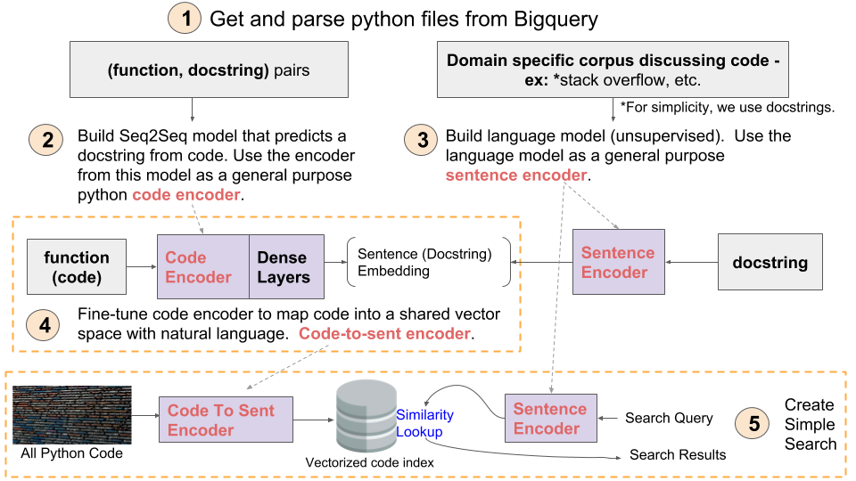

## Table of Contents

### Each step in the above diagram corresponds to a Jupyter notebook in this repo. Below is a high level description of each step:

[1 - Preprocess Data](https://github.com/hamelsmu/code_search/blob/master/notebooks/1%20-%20Preprocess%20Data.ipynb): describes how to get python files from BigQuery, and use the AST module to clean code and extract docstrings.

[2 - Train Function Summarizer](https://github.com/hamelsmu/code_search/blob/master/notebooks/2%20-%20Train%20Function%20Summarizer%20With%20Keras%20%2B%20TF.ipynb): build a [sequence-to-sequence model](https://towardsdatascience.com/how-to-create-data-products-that-are-magical-using-sequence-to-sequence-models-703f86a231f8) to predict a docstring given a python function or method. The primary purpose of this model is for a transfer learning task that requires the extraction of features from code.

[3 - Train Language Model](https://github.com/hamelsmu/code_search/blob/master/notebooks/3%20-%20Train%20Language%20Model%20Using%20FastAI.ipynb): Build a language model using [Fastai](https://github.com/fastai/fastai) on a corpus of docstrings. We will use this model for transfer learning to encode short phrases or sentences, such as docstrings and search queries.

[4 - Train Code2Emb Model](https://github.com/hamelsmu/code_search/blob/master/notebooks/4%20-%20Train%20Model%20To%20Map%20Code%20Embeddings%20to%20Language%20Embeddings.ipynb): Fine-tune the model from step 2 to predict vectors instead of docstrings. This model will  be used to represent code in the same vector space as the sentence embeddings produced in step 3. 

[5 - Build Search Engine](5\ - \Build Search Index.ipynb): Use the assets you created to created in steps 3 and 4 to create a semantic search engine.
